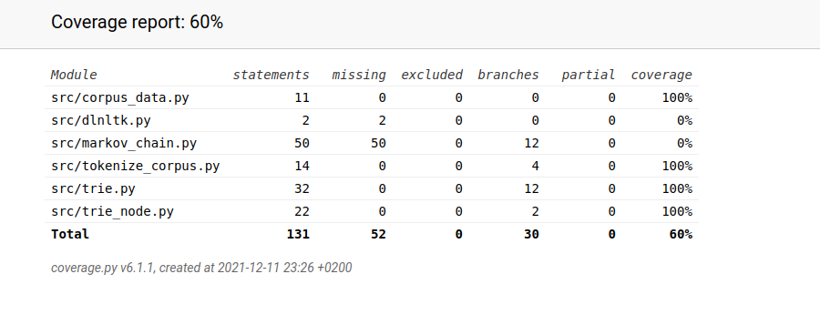

# Testausdokumentti

Yksikkötestaus on toteutettu pythonin unittest-kirjastolla. Käyttöliittymälle ei ole yksikkötestejä.

## Trie

### TrieNode
TrieNode-luokkaa testataan trie_node_test.py avulla. Se alustaa TrieNode-objektin ja testaa, että luokan metodit toimivat ja palauttavat oikein. 

### Trie

Trie-luokkaa testataan trie_test.py avulla. Testauksessa alustetaan Trie-objekti ja käydään sen metodit läpi. Testauksessa käytetään pääosin corpus.txt-tiedostoa, joka
löytyy muiden korpuksien ohella data/-hakemistosta. Testaus myös kattaa virhetilanteen, jossa annettua tekstitiedostoa ei löydy.  

## Markov

MarkovChain-luokkaa ei testata vielä.

## Kattavuus

Ohjelman kokonaistestikattavuus on 60%. Kattavuutta voi tutkia tarkemmin luomalla coverage-reportin README.md ohjeistamalla tavalla.

